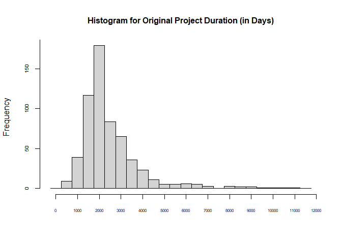
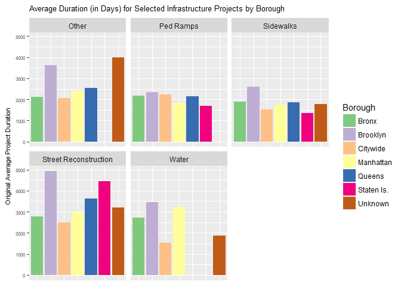
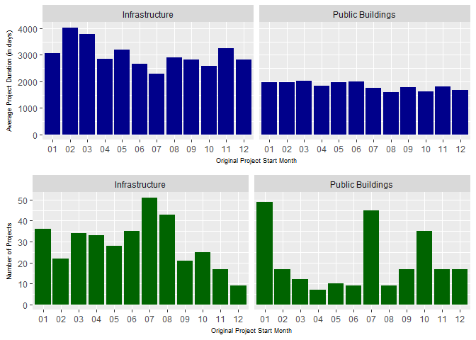
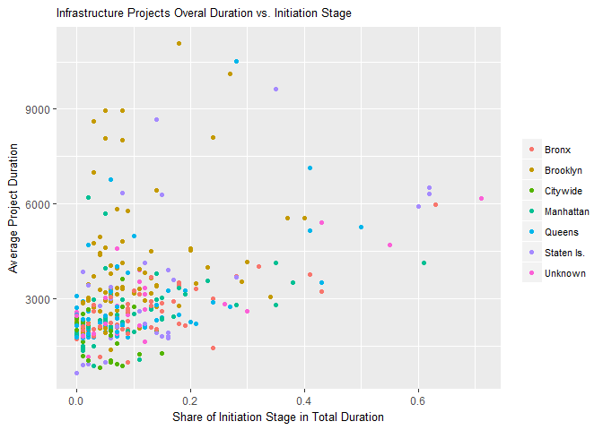

## Framework Overview

The main assignment of this challenge is to idenitfy factors that may influence project durations. However, this assignment can have multiple interpretations. After exploring provided sample data, I outlined project framework in the following manner:

**How do I measure project duration?** There are multiple types of dates: actual, original, projected etc. During data processing stage I realized that the best set of dates to use is "original" (see notes in the data prep document). Hence, I defined project duration as number of days between project start date and project closeout dates. 

**What is my universe?** After exploring NYC Open Data, I decided to use only sample data file provided (the datasets I found on Open Data had a lot less information available). Moreover, I limited the analysis only to projects that had non-missing original project start and closeout dates. 

**What factors am I going to consider?** This is the most challenging part. First of all, there are factors provided in the sample file and there are all other external factors (macroeconomic, weather, environment, fiscal etc.). Unfortunately, I did not have time to explore the impact of the latter. As for the former, I had to limit the pool of factors as well due to several reasons (i.e., laborious text processing for project descriptions and low match rates with available budget data). Hence, I focused my analysis on the following factors:

- Division Name, Project Type, Borough, Sponsor, Design Contract Type, Construction Contract Type (I selected these because I could interpret their values to some extent and they had enough variation in project duration to be interesting)

- Project seasonality based on the month the project started (I selected this because it might be reflective of how/when budgets become available. Though I couldn't test this hypothesis)

- Relative duration of each project stage (Since there are distinct stages for each project, I decided to examine if duration of certain stages can potentially impact total duration of a project)

However, I would say the main question I have in general:
**Why do we need to know these factors? What are we going to do with findings?**
The main reason I am asking is because, in general, there are factors of two types: *controllable* and *non-controllable*. If DDC wants to use the results of this type of analysis to improve project durations, my focus would need to be on controllable factors. But because I don't know what factors can be manipulated, it is hard to provide actionable recommendations. Instead, this analysis is more exploratory and descriptive.

## Exploratory Data Analysis

#### Project Duration Distribution

As pointed out earlier, the key metric for this analysis is Original Project Duration (measured in days between project start and closeout dates). 
Let's take a look at its distribution:


```
##    Min. 1st Qu.  Median    Mean 3rd Qu.    Max. 
##     280    1697    2136    2499    2876   11086
```

<!-- -->

Based on the above histogram, it appears that most of the projects in the sample data last between 3 and 10 years (1,000 and 4,000 days) with a long tail to the right (up to 30-year projects). However, I don't have any insight on how representative this sample is of the entire population of projects.

**Average Project Duration by Selected Factors**

During data processing I identified a few factors to consider while examining project duration. Let's take a look how average project duration varies by different levels of those factors.

*By Division Name*

```
## # A tibble: 2 x 3
##       DivisionName AvgProjDur     n
##              <chr>      <dbl> <int>
## 1   Infrastructure   2967.559   354
## 2 Public Buildings   1820.066   244
```

*By Borough*


```
## # A tibble: 7 x 3
##      Borough AvgProjDur     n
##        <chr>      <dbl> <int>
## 1 Staten Is.   3005.405    42
## 2   Brooklyn   2863.274   164
## 3     Queens   2609.241    87
## 4      Bronx   2296.435    92
## 5    Unknown   2216.950    60
## 6  Manhattan   2210.233   120
## 7   Citywide   1887.485    33
```

*By Sponsor*


```
## # A tibble: 18 x 3
##                     Sponsor AvgProjDur     n
##                       <chr>      <dbl> <int>
##  1 Trans. & Env. Protection   7116.333     6
##  2                      HPD   4095.600     5
##  3       Parks & Recreation   3511.000     2
##  4           Transportation   2867.458   260
##  5 Environmental Protection   2757.348    92
##  6     Emergency Management   2447.000     1
##  7                  Unknown   2312.000     4
##  8                     Fire   2235.600     5
##  9              Corrections   2080.667     3
## 10                     DCAS   2070.812    48
## 11           Libraries-NYPL   1989.050    60
## 12                   Health   1781.000     5
## 13            Libraries-BPL   1683.044    45
## 14        Homeless Services   1535.632    57
## 15           Libraries-QBPL   1198.500     2
## 16        Children Services   1018.000     1
## 17                    Aging   1008.000     1
## 18               Sanitation    746.000     1
```

*By Project Type*


```
## # A tibble: 12 x 3
##              ProjectType AvgProjDur     n
##                    <chr>      <dbl> <int>
##  1 Street Reconstruction   3791.058   139
##  2                 Sewer   3169.955    22
##  3               Unknown   2860.500     2
##  4                 Water   2776.000    45
##  5                 Other   2571.762    42
##  6      New Construction   2505.484    31
##  7                Street   2478.000     1
##  8             Ped Ramps   2033.235    34
##  9    Street Resurfacing   1889.357    14
## 10            Renovation   1834.867    90
## 11             Sidewalks   1828.385    39
## 12               Upgrade   1777.604   139
```

*By Design Contract Type*


```
## # A tibble: 16 x 3
##        DesignContractType AvgProjDur     n
##                     <chr>      <dbl> <int>
##  1    Standard Consultant   3126.311    45
##  2    In-House/Consultant   3022.520    25
##  3 DDC Managed/Consultant   3022.500     4
##  4               In-House   2533.803   137
##  5 DDC Managed Consultant   2492.500     2
##  6        Requirements TO   2452.464   263
##  7                   DCAS   2417.000     1
##  8                Unknown   2380.353    51
##  9   Design Excellence/24   2283.000     9
## 10 Individual Contract(s)   2255.500     2
## 11                     CM   2208.000     1
## 12   Requirement Contract   2146.646    48
## 13            DDC Managed   1931.333     3
## 14                   JOCS   1669.000     2
## 15                   None   1365.333     3
## 16               CM-Build    906.500     2
```

*By Construction Contract Type*


```
## # A tibble: 14 x 3
##    ConstructionContractType AvgProjDur     n
##                       <chr>      <dbl> <int>
##  1      Standard Consultant   3988.204    49
##  2   DDC Managed/Consultant   3544.571    21
##  3          Requirements TO   2944.359   167
##  4   DDC Managed Consultant   2891.900    10
##  5     Requirement Contract   2735.615    13
##  6   Individual Contract(s)   2428.167     6
##  7                  Unknown   2365.847    85
##  8                     None   2233.500     4
##  9               CM-Managed   1985.971    35
## 10              DDC Managed   1940.628   137
## 11                     JOCs   1610.857     7
## 12                     JOCS   1541.750    52
## 13              DEP Managed   1457.889     9
## 14                 CM-Build   1340.333     3
```

Based on the above:

- "Infrastructure" projects have longer duration compared to "Public Buildings"

- The most time-consuming projects are on Staten Island, but most of the projects are in Brooklyn and their average duration is second to the ones on SI

- The most time-consuming projects are sponsored by "Transportation" and "Environmental Protection" (I assume that "Trans." in "Trans. & Env. Protection" stands for "Transportation")

- There are 139 "Street Reconstruction" projects with average duration of 10 years (3,791 days)

- Top 3 Design Contract Types by duration are Consultant-related

- Top 2 Construction Contract Types by duration are aslo Consultant-related

It is actually hard to draw any solid conclusions on this data because a lot of variable values are not clear (for example, "Requirements TO" contract types have long durations. But what does "Requirements TO" mean?)

After some additional exploration, I discovered an interesting pattern: the most time consuming Infrastructure projects are done in Brooklyn. This is true across most common type project types. For the analysis below I arbitrarily selected types with more than 30 projects to ensure reasonable coverage across boroughs.

*Infrastructure projects duration by Project Type*


```
## # A tibble: 12 x 3
##              ProjectType AvgProjDur     n
##                    <chr>      <dbl> <int>
##  1 Street Reconstruction   3791.058   139
##  2                 Sewer   3169.955    22
##  3               Unknown   3019.000     1
##  4                 Water   2776.000    45
##  5                 Other   2743.200    35
##  6      New Construction   2640.850    20
##  7               Upgrade   2480.500     2
##  8                Street   2478.000     1
##  9             Ped Ramps   2033.235    34
## 10    Street Resurfacing   1889.357    14
## 11             Sidewalks   1806.649    37
## 12            Renovation   1796.500     4
```

*Infrastructure projects duration by Borough*


```
## # A tibble: 7 x 3
##      Borough AvgProjDur     n
##        <chr>      <dbl> <int>
## 1   Brooklyn   3925.605    86
## 2 Staten Is.   3322.219    32
## 3    Unknown   2888.615    26
## 4     Queens   2800.559    68
## 5  Manhattan   2578.434    53
## 6      Bronx   2537.804    56
## 7   Citywide   1887.485    33
```

<!-- -->

Based on the charts above:

- Brooklyn has the largest number of Infrastructure projects

- Brooklyn has the longest Infrastructure projects on average across all major project types

Potential reasons for the above are:

- Sample file was not representative of the entire population of projects

- Brooklyn is a high priority borough for large scale projects

- Brooklyn infrastructure is lacking behind other boroughs

However, all of the above are speculations that I cannot support using available data (at least within allocated time to submit this assignment).


**Average Project Duration by Month**

Interesting patterns appear while looking at seasonality of project starts.

The chart below contains average project durations by project start month as well as total number of projects started in each month. 

<!-- -->

Based on the above:

- Infrastructure projects that start at the beginning of the year (especially, in February and March) are longer in duration compared to projects starting at the end of the year. However, I would need to run additional testing to find out if there are significant differences across months and if I am properly controling for all potential confounding effects

- The duration of Public Buildings projects don't seem depend on month


**Project Duration Stages**

During the data prep I constructed a few variables to capture project duration composition. For example, what % of total duration is Initiation stage? 
Is there any relationship between overall project duration and how much time is spent in each phase? 

See below correlations between project duration and shares of each stage:


```
##   OrgInitiationDurPct       OrgDesignDurPct OrgConstructionDurPct 
##                  0.27                 -0.13                 -0.23 
##     OrgCloseoutDurPct 
##                  0.06
```

The strongest correlation is with the share of time spent in the initiation stage. There might be a few reasons for that:

- Longer projects require more time being allocated to the initiation stage (for example, it takes longer to secure budgets and get approvals)

- Projects that take longer to initiate belong to agencies that are not good at planning

However, if we zoom in on Infrastructure projects, the relationship between two variables is not clear. I would say there is at least one confounding factor that is contributing to different relationships between total duration and the share of tome allocated to the initition stage.

<!-- -->

Public Buidling projects don't show clear patterns in the relationship between project duration and initition stage.

<!-- -->

### Areas for Improvement

If I had more time (and more resources) I would:

- Identify main goals for this analysis. How is this analysis going to be used in decision making? To answer this question I would need to conduct interviews with different stakeholders.

- Instead of answering key question based on the available data, I would identify data that fits analysis needs and then task my team to obtain that data.

- Spend more time exploring data to make sure everyone understands it. Also, it would be important to split factors into controllable vs. non-controllable to make sure that final analysis results are actionable.

- It's hard to identify proper statistical methodology for this analysis without having all the data at hand. But I think the final output to stakeholders would contain a list of factors they can control with assigned level of importance. It would also be helpful to build a simulation that shows how changing different factors affects main KPI.


